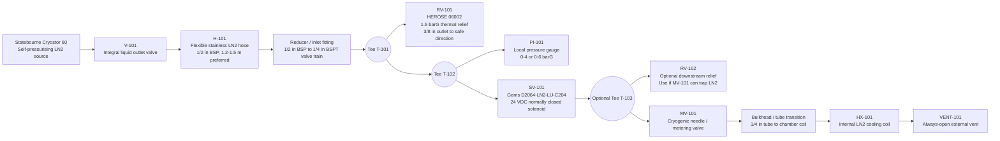

# LN2 Valve Train Schematic

_Last updated: 2026-06-07_

## Purpose

Draft P&ID-style working schematic for the external liquid-nitrogen valve train. This is not yet a fabrication drawing. It captures the intended functional arrangement, device tags, relief logic and open questions.

The current design treats the "manifold" as a short, supported valve train assembled from cryogenic-rated tees/adapters/fittings rather than a custom machined manifold block.

## Key device tags

| Tag | Device | Current selected part / status | Notes |
|---|---|---|---|
| V-101 | Cryostor liquid outlet valve | Integral to Statebourne Cryostor 60 | Source isolation; Statebourne service/check pending |
| H-101 | LN2 transfer hose | Statebourne 3701004 or 3701006 candidate | 1/2 in BSP flexible stainless hose, 1.2-1.5 m preferred |
| RV-101 | Main external thermal relief | HEROSE USS-06002.0200.0000 | 1.5 barG, 1/4 in BSPT male inlet x 3/8 in BSPT female outlet |
| PI-101 | Local manifold pressure gauge | TBD | 0-4 barG preferred, 0-6 barG acceptable |
| SV-101 | Main LN2 solenoid | Gems D2064-LN2-LU-C204 | 24 VDC, 15 W, 1/8 in orifice, 375 psi, 1/4-19 BSPT female |
| RV-102 | Downstream thermal relief / spare | HEROSE USS-06002.0200.0000 | Use if downstream needle valve can trap liquid; otherwise spare |
| MV-101 | Cryogenic metering/needle valve | TBD | Manual LN2 flow trim downstream of solenoid |
| HX-101 | Internal LN2 cooling coil | 1/4 in OD copper or 316/316L tube target | Continuous tube preferred, no internal joints |
| VENT-101 | Coil outlet vent | TBD external safe vent path | Always open; do not vent into chamber/freezer atmosphere |

## Draft schematic



## Relief logic

### RV-101 required

RV-101 protects the external section that can be trapped when both of the following are closed:

```text
V-101 Cryostor liquid outlet valve closed
+
SV-101 normally closed solenoid closed
```

The Cryostor's own relief/burst devices protect the dewar, but do not protect external hose/valve-train volumes downstream of a closed dewar valve.

### RV-102 conditional

RV-102 is required if the downstream path can trap liquid, for example:

```text
SV-101 closed
+
MV-101 fully closed
+
liquid trapped between solenoid and metering valve / coil inlet
```

If the downstream side becomes a fixed restrictor feeding an always-open coil/vent path, RV-102 may remain a spare. During commissioning, assume the needle valve can be closed and either fit RV-102 or enforce an operational rule that avoids trapping liquid.

## Thread/interface notes

| Interface | Current expectation |
|---|---|
| Cryostor outlet / hose | Statebourne 1/2 in BSP ecosystem; confirm from Statebourne |
| HEROSE 06002 inlet | 1/4 in BSPT male, ISO 7/1 |
| HEROSE 06002 outlet | 3/8 in BSPT female, ISO 7/1 |
| Gems solenoid ports | 1/4-19 BSPT female |
| Gauge | Request 1/4 in BSP/BSPT if possible |
| Needle valve | Request 1/4 in BSP/BSPT or tube-compression LN2-rated option |
| Coil tube | 1/4 in OD tube target, copper or 316/316L stainless |

## Mechanical layout rules

- Keep the valve train short, rigid and mechanically supported.
- Do not leave a long chain of fittings hanging from the Cryostor hose or Gems solenoid body.
- Mount the valve train to a small bracket or panel.
- Direct HEROSE relief outlets away from people, electronics, freezer interior and camera hardware.
- The coil outlet remains always open to a safe external vent path.
- Avoid trapped LN2 volumes unless protected by thermal relief.

## Open items

- Confirm Statebourne hose length/end fittings and any Cryostor-side relief recommendation.
- Confirm HEROSE quote for metering valve, manual valve, pressure gauge and fittings.
- Decide whether RV-102 is installed immediately or kept as spare based on final metering valve arrangement.
- Select final coil tubing and bulkhead/fitting approach.
- Produce a later issue-for-build drawing after the physical chamber/hose layout is known.
