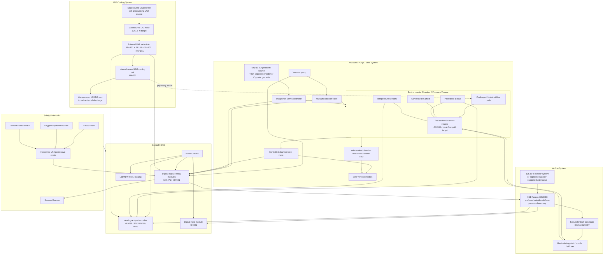

# Environmental Chamber System Block Diagram

_Last updated: 2026-06-07_

## Purpose

High-level system block diagram for the RB Wingsuite environmental chamber build. This diagram captures major subsystems and interfaces rather than detailed fittings, wiring or fabrication geometry.

## Overall architecture

## Major subsystem notes

### LN2 cooling system

- Primary LN2 source path is Statebourne Cryostor 60, pending service/check and hose confirmation.
- External LN2 valve train is not a custom manifold block initially; it is a supported assembly of cryogenic fittings, tees, reliefs, gauge, solenoid and metering valve.
- LN2 must remain inside sealed tubing/coil and exhaust to a safe external vent.
- LN2 must not be intentionally vented into the chamber/freezer atmosphere.

### Airflow system

Two parallel routes remain open:

1. Schubeler EDF route, currently strongest compact candidate.
2. Conventional high-pressure centrifugal/radial blower route, likely requiring an external sealed plenum or remote/belt-drive architecture.

For the EDF route:

- Fan/motor may need to sit inside the low-pressure recirculating airflow if Schubeler confirms suitability.
- ESC and batteries/power electronics should remain outside cold/low-pressure volume where possible.
- YGE Aureus manual currently indicates battery-only operation, not direct PSU operation.
- Rotor containment and overspeed/telemetry shutdown remain important design items.

### Vacuum / purge / chamber protection

- Chamber pressure target is approximately 24 kPa absolute.
- Purge/backfill system is still TBD.
- Use dry nitrogen purge/backfill if practical to reduce frost/moisture.
- Chamber overpressure protection is separate from LN2 line thermal relief.
- If LN2 coil failure can dump nitrogen into chamber, chamber relief/vent sizing must account for that credible fault.

### Control and safety

- NI cRIO-9068 is the main controller.
- NI 9239 handles key 0-10 V signals such as Keller absolute pressure and Dwyer Pitot differential pressure.
- NI 9211 handles thermocouples; NI 9219 now available as a universal spare/development input module.
- Digital outputs must drive interposing relays/contactors/drivers only, not high-power coils/loads directly.
- LN2 enable must require a hardwired safety permissive chain, not software command alone.

## Boundary assumptions

| Boundary | Current intent |
|---|---|
| LN2 pressure boundary | Cryostor + hose + external valve train + sealed coil + external vent |
| Chamber pressure boundary | Vacuum chamber/freezer pressure volume plus any sealed duct/plenum extensions |
| Cold boundary | Chamber/freezer interior and cold recirculating airflow path |
| Power electronics boundary | Prefer outside cold/low-pressure volume |
| Safety boundary | E-stop/O2/door/permissive chain independent of software |

## Open diagram actions

- Add exact Statebourne hose/outlet fitting after quote.
- Add exact HEROSE metering valve/manual valve/gauge/fittings after quote.
- Add final airflow route once Schubeler/industrial blower decision is made.
- Add chamber purge/vent/overpressure relief once chamber port layout is developed.
- Create separate wiring/interlock diagram once final actuators and sensors are selected.
